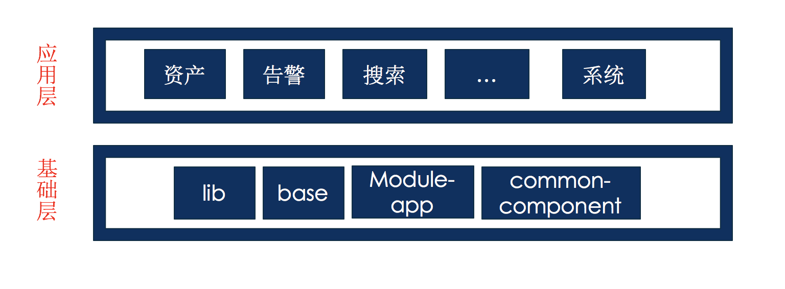

# 2018 年反思

在介绍下面主体的时候，先介绍一下项目特点。我们做的是一个企业安全项目。这个项目的特点是参与人比较多。需要大改 20 个左右的前端，开发 3 个月时间。也就是 60 人月的项目。3 个月时间里面最后一个月会反复进行大范围测试，测试也是十多个人。并且，这个 项目会反复迭代。一年一个大版本，几个小版本。

之所以先介绍项目人月，是因为不同规范项目、不同特点项目面对的问题、需要关注的问题都不太一样。

## 文档

文档主要讲的是产品文档、技术文档。

产品文档主要包含产品的 prd、产品的原型图、产品的规格文档等等

技术文档主要包含技术的规范性文档。例如接口规范文档、前端代码各种规范。

### 产品文档

产品属于真个产品周期的源头，产品的准确传递对整个项目影响最大。产品 文档的错误和不规范会导致后续的设计、开发、测试递增性工作量。

我们的产品文档经历过几个阶段。

**第一阶段**

产品把产品需求写了一个完备的 prd 文档，以 word 和 pdf 的格式 递交给开发。开发和测试依据这些文档进行开发和测试。

这样的好处是产品需求有处可查。但是随着开发过程中，产品的修改。这个文档会反复修改。修改过程中因为 word 格式的性质、导致了最终出现了四五份产品文档，每一份文档内容新旧不同。到了最后产品文档陷入了灾难。没人知道那些是正确的，那些事新的，那些事旧的。还有一些需求直接以蓝信聊天的方式发送、有些是口头传递、最终产品需求散落各处，陷入 了混沌。

后期因为人员变动，遇到功能新增或者维护，没有人能够说出来这块功能如何设计 ；或者新接手的人需要寻找几天人才能搞懂之前功能的一块设计意图。

第一阶段我们通过 word 或 pdf 记录需求，我们最终陷入了有文档、不可用的境地。

**第二阶段**

鉴于第一阶段文档虽多、维护和使用成本过高、后期无文档可用的情况。这个阶段我们采取只要原型、具体的产品需求对应的产品、开发、测试建立小群单独沟通的聊天沟通方式进行。

这种方式的好处是，简单高效。不用维护细致、繁琐的文档、只用出关键的一些规格文档。前期开发过程中依靠开发和产品的频繁 review，开发效率相对纯粹参考文档有一定提升。

这种方式也有一定的隐患。项目后期的维护、其他定制化团队开发和维护遇到需求问题的时候只能去询问对应的产品。如果对应的产品和开发、测试出现人员变动的话，这个需求就没人可以说清楚了。

**当前阶段**
wiki 和 jira 这样的企业管理工具我们也用的比较多。wiki 这样的文档工具没能大面积使用，很多时候很多同学不去看、或者找不到对应的文档。另外 wiki 的在线编辑模式体验不够好，再加上不少同学不会使用 wiki，所以这样集成工作的文档管理工具没有很好的用起来。

鉴于之前的 wiki 没有很好的发挥作用。我们利用 gitlab 的 wiki 和 git 里面自己建设的 doc 目录来归纳和总结文档。

**下一个阶段**

如果 wiki 进行大范围培训、规范使用，wiki 操作更简便，也许 wiki 是不错的工具。

寻找到更好的团队协作文档工具，方便产品的及时更新、产品的集中管理。

理想中类似一些开源 的 github 规范的文档就挺好，例如 openapi 这样的纯文本文档。
或者 类似 vue 这些 技术文档。这些文档都是纯文本、容易编辑、可以离线操作、查看、也很容易协作。

### 技术文档

接口文档后端通过一个 svn 上面的 word 提供了出来。因为 svn 权限文档和 word 的不方便版本记录的问题。这个规范传播和参与度比较差。最好还是容易修改、分享的纯文本格式。

基础组件和业务代码里面的文档和注释没有统一规范，影响了基础组件的使用和传播。也影响了业务代码的统一。

后面添加 jsdoc 类似的工具，规范文档书写格式。这样文档的更新和规范都能得到保证。

## 微服务

首先我们开发的项目比较大，压缩打包后部署代码就有 50M 以上。

**前期**

因为项目过大，代码的开发启动和构建都比较耗时。其他团队听到过打包半个小时的情况。我们 团队重启一下开发环境也需要去上个厕所、抽根烟。

项目提测阶段，一个小 bug 就需要重新花费十多分钟重新打包。

一个模块里面的一个错误，可能导致其他模块的错误和崩溃。例如因为是一个巨型 spa， 全范围寻找内存泄露就需要两天时间。

因为部署的是一套代码，一个小改动，就需要全量前端代码替换。测试需要付出巨大工作量，保证项目的正确性。

**现在**

后来有同事把微服务引入到了开发中。我们把项目拆分为了十多个模块，每个模块单独开发部署、测试。现在每个模块都可以秒开，模块内部的错误也不会 影响到其他模块，每个模块可以单独开发、部署、测试。

**微服务和 SPA**

微服务上线后，领导突然吐槽每个模块点击就页面空白去刷新。要求改善体验。

微服务改为 spa 根据要求、工作量有很多办法，是个大课题。

可以把微服务修改打包 方式，打包的时候打成 spa，这样就丧失微服务的一些优点了。

还可以使用一些开源的微服务框架，这个需要对现有的模块进行大范围修改

最终，我们采用 iframe 的方式来做微服务的 spa

每个 子系统，当 打开其他系统的时候，就好创建一个 iframe 去加载其他子系统，加载完成够显示在页面。这样加载其他子系统的时候，相互之间可以比较平滑的切换，用户体验会很好。

此外，这样的系统在做插件化的时候，相比之前纯粹的 spa 也有很大的优势。传统的 spa 插件化只能支持同框架，例如 vue 做的 spa 去支持 react 的插件化子项目的时候 就比较麻烦。但是微服务的时候，对框架是没有限定的。

## 微服务的开发模式

微服务要求把大的 app 拆分为多个小的 app。小 app 可以独立运行，之间通过特定方式通信。

**拆分**

微服务项目开发的首要标准是拆分项目。拆分方式我们采用过两种：sub module 和 lerna

通过 git 子模块的方式组织子模块，git 子模块适合拆分项目，但是需要写很多的命令来完善工作流。

lerna 是很多流行仓库的 开发模式。以 monorepo 的单仓库多包的方式来集成管理大型项目。lerna 提供了一些常用的命令极大方便了项目的管理和开发。

**开发**

项目拆分后，需要搭建开发环境。vue-cli 作为 vue 社区的工具、历经 三四个核心开发人员一两年的开发、工具栈比较丰富、质量也比较稳定。

但是 vue-cli 不支持 monorepo，我们进行了改造，使其支持了 monorepo 的开发模式。最终效果是一个 vue-cli，
可以在各个单独模块使用打包。

这样每个模块独立开发、部署、测试、文档，但是不用配置开发环境。然给每个开发人员只用开发，不用关心配置。

## 项目结构

大型项目的拆分、不仅关系到人员分工、也关系到代码的质量、稳定性、可维护性。所以需要合理的划分。

**lib**

lib 是用来 统一管理依赖的。项目开发中随着开发进度，总会引入很多的依赖，最终的项目大小会很膨胀。所以管理依赖、明确依赖对项目的维护很有意义。

我们会列出文档，按照依赖的类型进行划分， 这样做除了可以约束项目的大小、 更能约束代码的风格、让代码更内聚。这样对代码的可维护、质量、性能都有帮助。

**base**

随着开发的进展，我们会积累一些基础库。例如我们自己封装的 rpc 这样统一请求方式的语法糖，base.css 这样统一全局样式的基础库。

base 就是我们自己场景的公用基础代码的工厂。公用代码都放到这里、去不断的丰满，以此来减少业务代码的膨胀和
扩散。最终提高 开发效率。

**common-component**

除了基础组件库 FUI 之外，我们 业务开发中也会有很多多个模块公用的一些组件。 例如我们把 基础表格和分页组件
封装在一起的业务表格组件。把表单组件封装在一起的动态 搜索组件。

基础表格组件把分页、排序等基础功能和我们 制定的后端接口规范融合起来，产生了使用特别简单的业务组件。

动态 搜索组件依据接口规范，动态生成复杂的查询表单。这样也极大的节省了工作量。

类似这样的组件还有很多。 项目开发完毕后，我们积累的几十个组件。这些组件的使用减少了业务代码的数量。

当然，随着时间发展，我们会沉淀出不同使用场景的组件，让项目的开发慢慢变成乐高组件一样的拼装模块，组件丰富完善后，对应的拖拽化生成系统都可以开始去做。

**module-app**

module-app 设计为 模块的容器。他和特定业务强相关、里面主要包含数据模型处理(jsdata)、数据流处理(vuex)、路由处理、基础组件库注册(FUI)、产品特定风格的登录页面、产品的菜单。

module-app 是一个容器他里面包含很多模块。每个模块定义路由和组件的对应关系。module-app 这个容器去挂载
和小时这个模块。

**应用模块**

应用模块调用 lib 的依赖，使用 common-component 里面的组件，定义业务特定的组件树和路由。

把业务的定义对象传入 module-app，启动起来。

## 测试

相信周围很多的 程序员没有写过测试。我们的业务开发中，尤其是我们这种 tob 的项目，产品上线后直接提供安装包给用户。所以我们的开发过程中开发两个月、测试 三个月很正常。每次开发周期，到测试阶段我们 都被 p0、p1 这样的 bug 追着跑。

曾经我们考虑过使用阿里的 ui record 来录制测试用例，不过因为需要动用比较多的人力成本，另外这个方法有一定的弊端，而没有很好的推动起来。

项目前期开发，大家工作比较忙。 后期已经累得不想动之前的代码，更不用写测试了。

重构的前提是要有测试，写测试的代码会要求 你去考虑代码的模块化、封装性。然后有了测试的保证、你才可以安心的去重构。但是在快速开发、快速的迭代的场景、测试就不太适合了。

但是我们真的不需要测试吗？显然也不是。我们的基础 组件库之前缺乏测试，后期为了赶任务、硬加了一些测试。但是测试的用例没有集成起来、也没有发挥作用。这样导致了一些问题：我们的 FUI 基础组件库、出现过多次发布版本后，组件出现异常的问题。虽然我们负责发版的组件负责人很小心、很谨慎、这样的问题还是不能避免。因此组件库
这种迭代不多、关系重大的基础代码写测试对开发和推广都是必须的。

## 组件库

之前的项目里面，我们使用的是一些流行的 ui 组件库。使用这些组件 库，有的时候 会 遇到这些组件库有 bug、或者 ui 风格、交互风格不符合我们的要求。 最后我们依靠开源社区构建了一套自己的满足自己需求的 UI 组件库。

构建自己的 UI 组件库，有利有弊。

好处是自己的 UI 组件库，自己的控制力比较强。可以根据自己公司的 UI 设计风格进行设计，可以根据自己的业务进行优化和处理。例如 element ui 他里面的一些组件没有考虑大数据的情况，我们做的时候就可以针对性能问题，出一套解决方案。

当然自己再去做一套 UI 组件要耗费很多精力，自己要对组件库的开发、维护、文档、构建耗费精力。

这是一个取舍，根据自己公司的情况合理选择。一般来说小公司没必要自己搞一套。大型公司和项目有的情况下还是有必要构建一套自己的 ui 组件库的。

## 规范

规范有很多层面的，我们 下面一一列出

**UI 规范**

项目一旦变大的时候，因为产品的敏捷迭代、 样式功能一直修改。前期设计给高保真设计图的工作量也太大。因此很多时候每个模块都是参照产品的原型进行样式和交互处理。

项目最终完工的时候，各个模块会有比较明显的不一致性。

如何解决这样的问题，我们考虑可以从多个方面入手。

首先，页面布局要统一使用组件库里面的布局组件，要规范使用。其次，布局统一后，一些一致类似的样式要尽量抽取到基础样式里面。

实施方案是：

    产品、设计、开发一起安装 弹出框、按钮、表格、区块等梳理出规范。然后开发总结出一套布局组件规范、基础样式规范。开发的时候大家按照规范进行布局、填写样式。
    最后还需要设计在后面不断走查、逐步完善和丰满规范。

**接口规范**  
项目的几次 大版本迭代中，我们体会到一个问题。对用户来说没有变化的功能，我们每次还是需要进行大的修改，甚至不同 模块类似的功能，都需要对应的编码。并且，接口的变化会直接影响后续的业务逻辑和视图渲染。

反思之后，我们发现这是缺乏明确的接口规范。openapi 和 emberjs 遵循的那样接口规范就是来解决类似问题的。

这些接口规范，对数据模型、字段定义、格式说明都有明确定义，甚至还提供了不少的工具，例如格式校验工具、接口测试工具等等。

但是，开发中 因为习惯问题，这样的规范很难去推动。很多团队都是自己造了一些规范，这些规范因为不够完善、工具辅助不够导致效果并不好。很多开发最终的代码没有遵循这样的规范进行。

我们有感于接口混乱对 前端开发影响。开发了 fapi 这样的接口管理平台。fapi 现在可以让后端录入接口、给接口添加文档。但是这些 也只是比之前后端接口 无序的记录、格式稍微有一点改观，还是没有强约束接口。对接口的统一、规范、完备、 一致性还有欠缺。我们希望有更全面、更完善的规范和工具可以让接口模型化、规范化。

之前看过有团队分享，通过一些中间语言来描述接口。前后端依赖这些接口进行对接开发，这个做法不错，不过还是需要很多的模型能力。实践中也没有看到很好的解决 办法。

**模型层规范**
